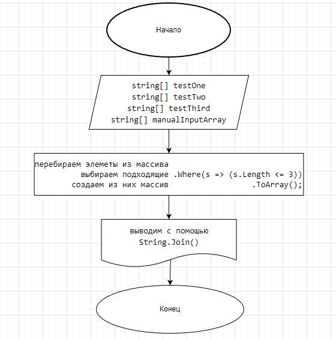

# final-verification-work

    Задача : 
       Написать программу, которая из имеющегося массива строк формирует массив из строк, длина которых меньше либо равна 3  символа. Первоначальный массив можно ввести с клавиатуры, либо задать на старте выполнения алгоритма. При решении не рекомендуется пользоваться коллекциями, лучше обойтись исключительно массивами
Решение:

   Для решения воспользуемся методом самого массива

   у массива вызовем метод ***.Select(s => s)*** который работает на подобии цикла *foreach* т.е. перебирает элементы массива

   затем команда ***.Select()*** имеет настройки ***.Where(s => s.Length <= 3)*** т.е. оставляем только те элементы которые

   подходят под наше условие "s.Length <= 3"

   ну а теперь добавляем .ToArray() что бы собрать отобранные элементы в массив.

  ***Select(s => s).Where(s => s.Length <= 3).ToArray();***

  Для вывода используется метод String.Join();

#
  # Диаграмма

  
